# Group-Video-Calling-WebRTC
Group Video calling application using WebRTC

# Technologies used 
- [X] WebRTC
- [X] Javascript

### WebRTC
WebRTC is a set of javascript APIs that allow us to establish peer to peer connection between 2 browsers to exchange data such as audio and video in real time

# Helpers
1. WebSocket vs WebRTC
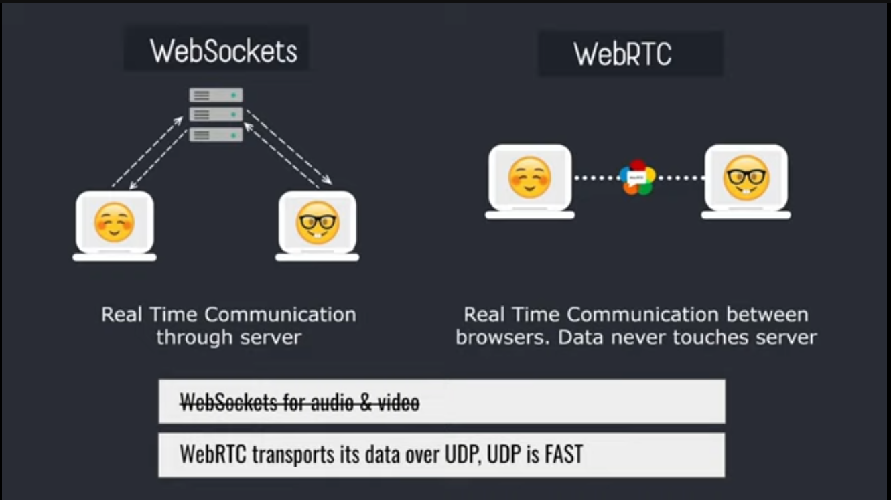
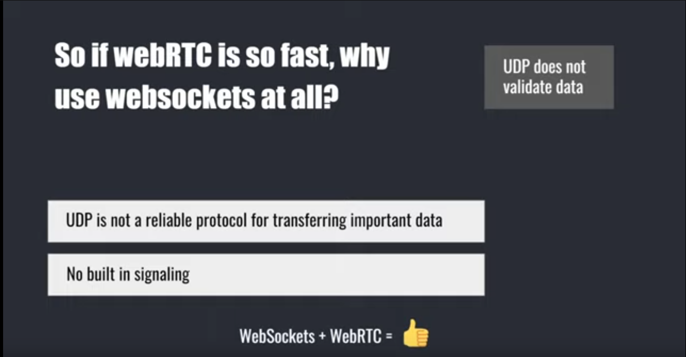
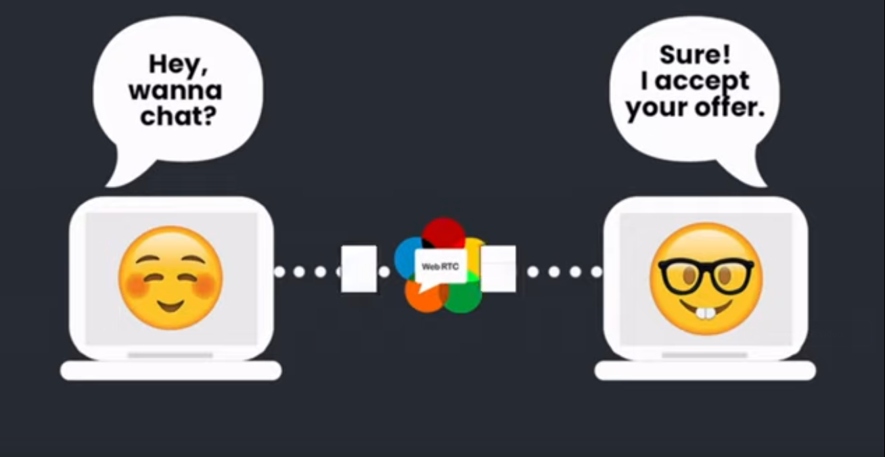

2. Signalling 
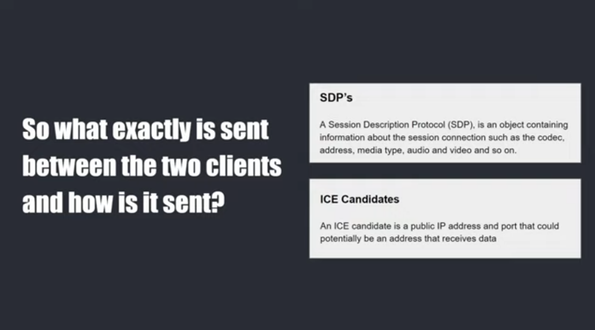

3. Exchanging session Description Protocols and ICE candidates
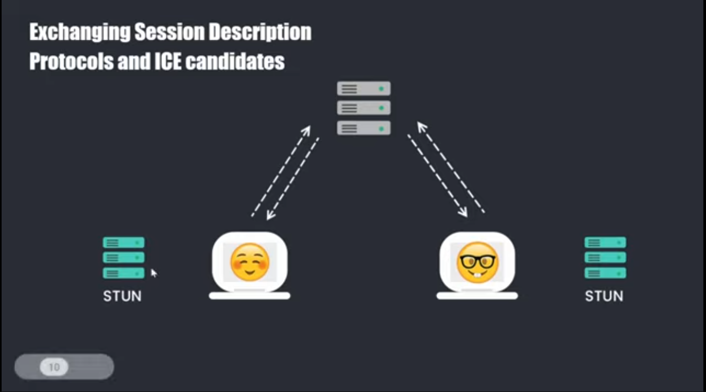
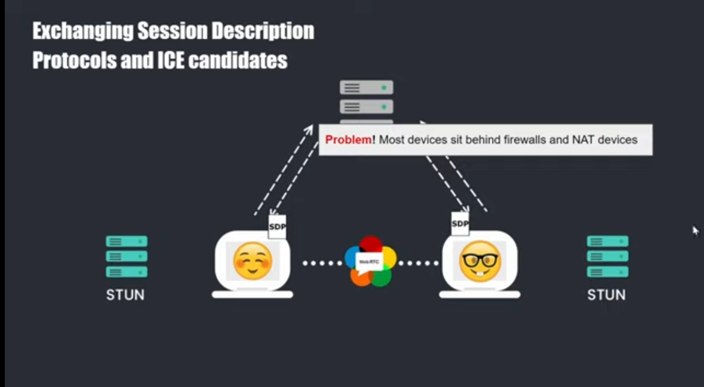
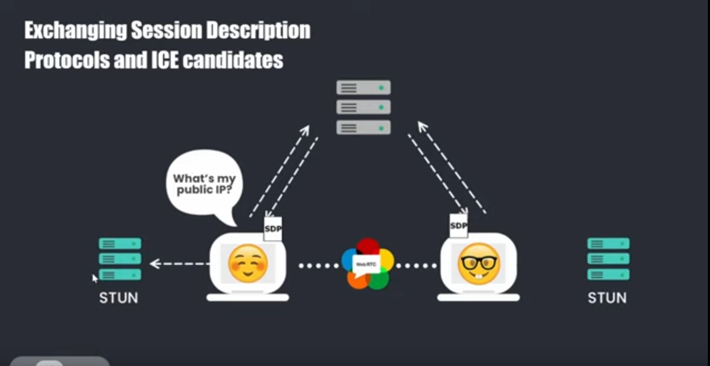
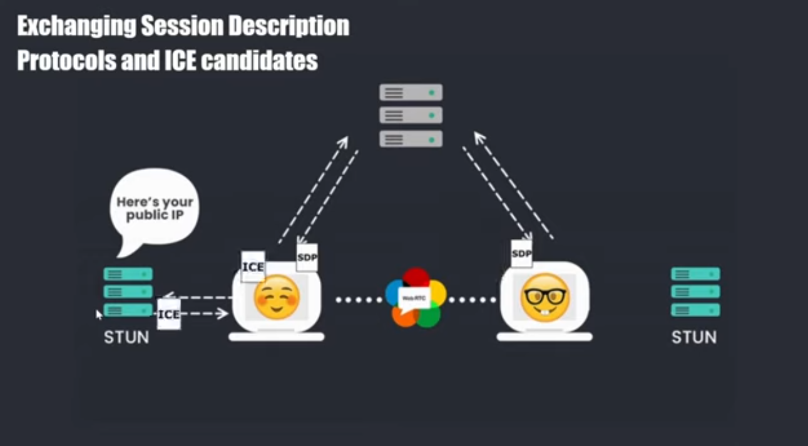
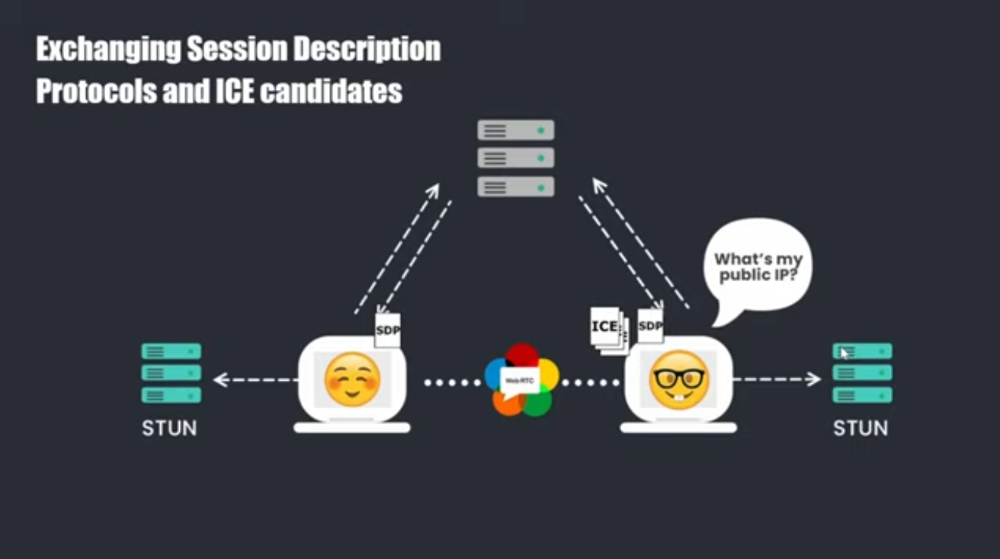
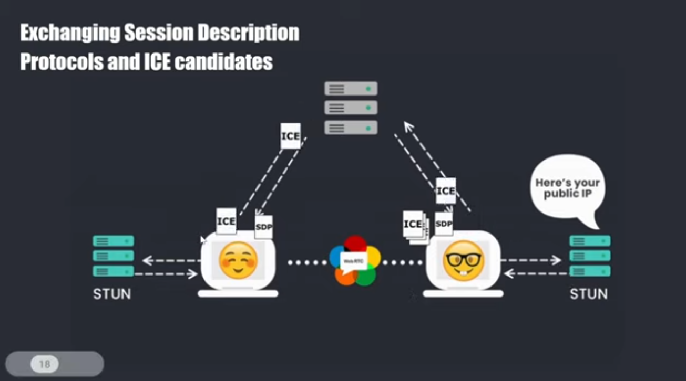
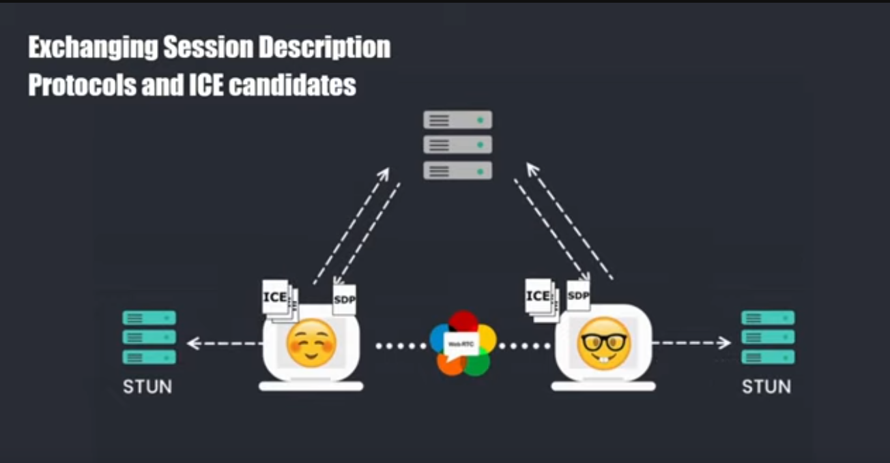

4. Trickling ICE candidates
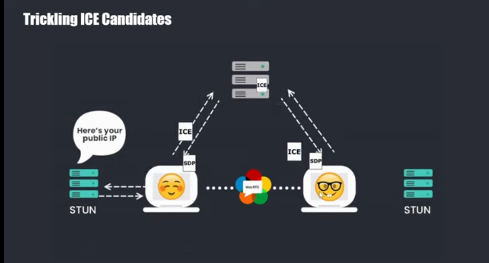
